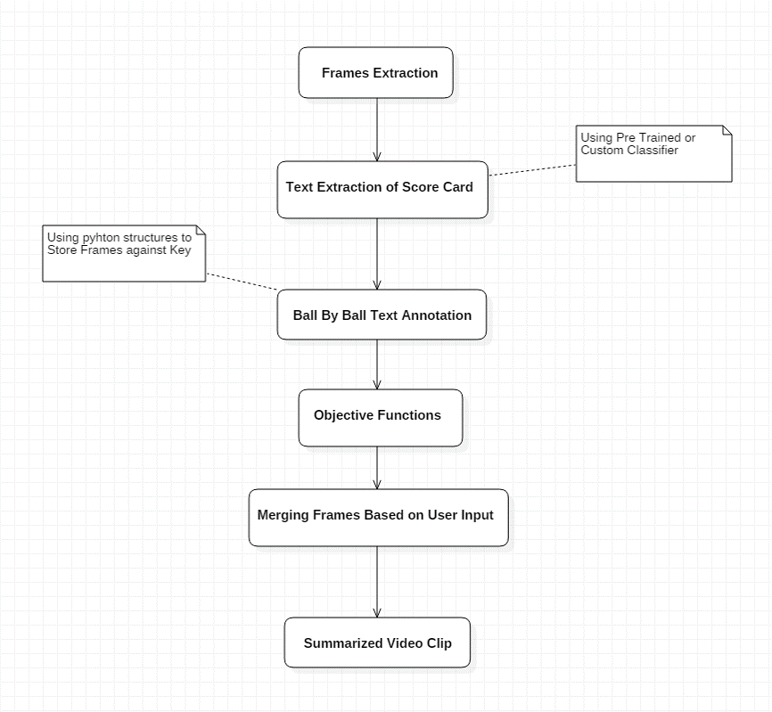
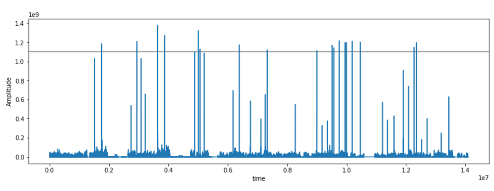
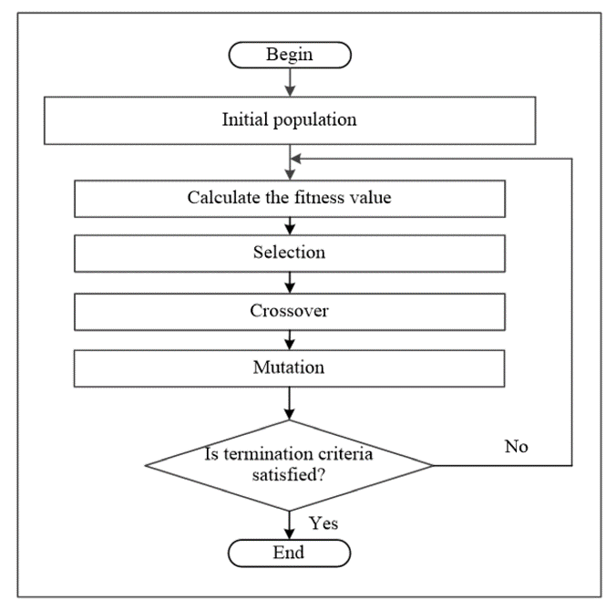
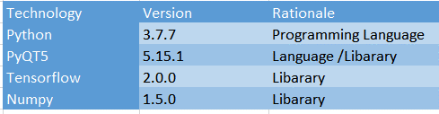
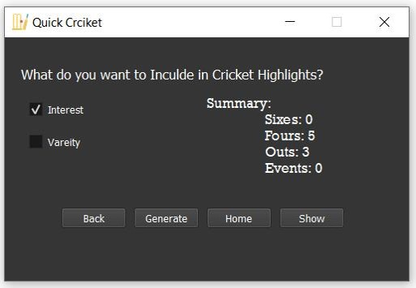
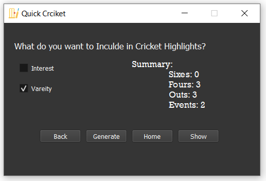

# Quick Cricket
Extraction of Cricket Highlights Using Machine Learning & Computer Vision Techniques.

## Intorduction:

Professional editors manually crops the interesting events that occurs in a match and joins in sequence to make cricket highlights. Each year many cricket matches are recorded and the viewers wants quick updates of the match by watching highlights. 

 
These problems are the main reasons behind the need of automatically highlights generator system based on AI, Computer vision and Machine learning. 
   

## Project WorkFlow:
  

## Algorithms:
 

> Scoreboard text detection & recognition

1. Selecting a cricket video
2. Frame extraction (Using OpenCV Lib)
3. Image Pre-processing (Image Sharpening Filters)
4. Selecting scoreboard area (ROI with Mouse)
5. Scoreboard text detection & recognition (<a href="https://github.com/tesseract-ocr/tesseract" target="_blank">Tesseract OCR</a>)
 

> Audio-Based Important Events Extraction 

1. Convert 2 Audio Channels into Single Channel.
2. Perform down sampling (to decrease the sampling rate or sampling size)
3. Best threshold value is set by taking the maximum value from the energy array and then take 80 percent of it. 
  

  

> Simple Genetic Algorithm 

1. Generating Initial Population 
2. Setting Up Fitness Function
3. Making Probability List 
4. Random Selection (Roulette Wheel Selection)
5. Performing Crossover
6. Performing Mutation 

  

  

> Cricket Highlights Generation

1. The clips are merged according to the best chromosome generated in the simple genetic algorithm.
2. The Highlighted video will be saved in our current project directory.

  
## Project Dependencies:
  

  

## Genetic Algorithm Events:
  

  

  

## Input Video:
1. Sample Video Link:
https://drive.google.com/file/d/1WbR5t9nn1tjRnTqFnWT2Zn5rfciG3vRD/view?usp=sharing

## Final Output Video:

1. https://www.youtube.com/watch?v=2S_dpP_h_LU

## References:
 

1.   https://www.researchgate.net/publication/359692483_A_survey_on_event_detection_based_video_summarization_for_cricket

